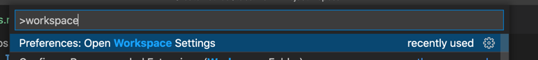
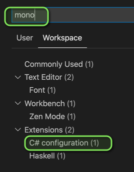
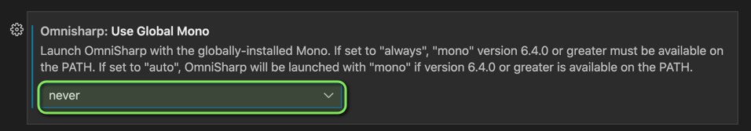
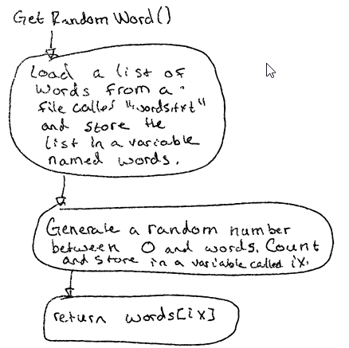
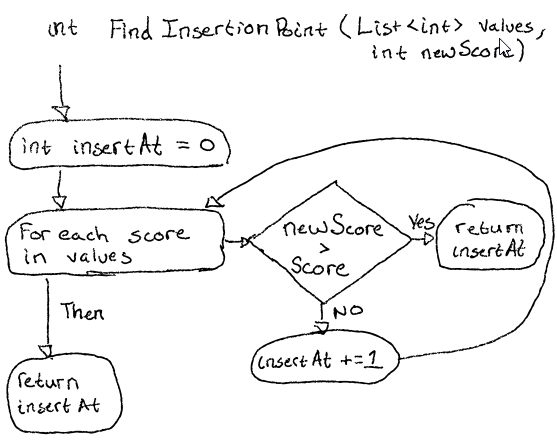

# Part 2.1: Implement Method Stubs

By now, you should have completed at least one draft of your project proposal.
The first thing you should do for your project is to create "stubs" for the
methods you will write. This will allow you to start testing each of your
components independently of each other.

If you're having trouble remembering how methods work, you can review them in:

* C# Cookbook: [LINK](https://github.com/jcollard/CSharpCookbook/blob/main/StaticMethods.md)
* C# Player's Guide, Level 13: [Google Classroom](https://drive.google.com/file/d/14Da3-VgfONhMoEfjMwCd217n8R2EySSe/view)

## 1. Generate a Program.cs with a Main Method

If you have not done so already, follow the instructions in [Step 0](Setup.md) to generate a
C# project. This will result in a `Program.cs` file which you can execute using
`dotnet run`.

## 2. Enable Autocomplete / Error Lines

1. Open your project in Visual Studio Code
2. Open your `Workspace Settings`
   * In the command palette (Command + Shift + P) find `Open Workspace Settings`



3. On the Workspace Settings page, search for `mono`
4. Select `C# configuration`



5. Find the `Use Global Mono` setting and set the value to:
   * `never` - If you are writing a C# Console Project
   * `always` - If you are writing a Unity project



6. You will need to restart Visual Studio Code for this to take effect

## 2. For each method in your proposal, create a method stub

Next, take each method flowchart and write a method stub for your project.

### Example: GetRandomWord()

For example, in the [Wordle](Examples/Wordle.md) proposal we have the following method flowchart:



This method has 0 parameters and returns a `string`. The method stub will look
like this:

```csharp
public static string GetRandomWord()
{
    return null;
}
```

Then, add in the algorithm steps you wrote as comments within the method. These
will be TODO steps for you to finish the method:

```csharp
public static string GetRandomWord()
{

   // 1. Load a filed called `words.txt`
   // 2. Store each line as a separate word in a list named `words`
   // 3. Generate a random number between 0 and `words.Count` and store the result in
   //    a variable called `ix`
   // 4. Return the word at position `ix`. (e.g. `words[ix]`)
    return null;
}
```

### Example: FindInsertionPoint(List<int> values, int newScore)

For example, in the [High Score Tracker](Examples/HighScoreTracker.md) proposal
we have the following method flowchart:



This method has 2 parameters and returns an `int`. The method stub will look
like this:

```csharp
static int FindInsertionPoint(List<int> values, int newScore)
{
    return -1;
}
```

Then, add in the algorithm steps you wrote as comments within the method. These
will be TODO steps for you to finish the method:

```csharp
static int FindInsertionPoint(List<int> values, int newScore)
{
    // 1. Initialize a counter variable, insertAt, to 0.
    // 2. Loop through each value in values
    //    * If the new score is greater than the current value, we should insert above
    //      that score so we return `insertAt`.
    //    * Otherwise, the new score should not be inserted above this score so we
    //      increment `insertAt` by 1 and continue.
    // 3. If we reach the end of the list, `insertAt` should be the length of the list
    //    so we return `insertAt`.
    return -1;
}
```

## 3. Add a Documentation Comment to Each of your Methods

Finally, you should add a documentation comment to each of your methods. If you
completed your proposal method section, these should be straight forward.

For example, in the [Random Name
Generator](Examples/Random%20Name%20Generator.md) proposal there is a method
called `GetPositiveInt(string prompt)` which accepts an string and returns an
`int`. The documentation comment for this method would look like this:

```csharp
/// <summary>
/// Given a prompt to show to the user, displays the prompt then reads
/// input from the keyboard until the user enters a positive number. If
/// the user enters a non-positive number, this method displays an error
/// message and prompts the user again.
/// </summary>
/// <param name="prompt">The message to display to the user</param>
/// <returns>The positive number the user chose</returns>
public static int GetPositiveInt(string prompt)
{
    return -1;
}
```

## 4. Commit, Tag, and Push your project

When you're done, you should:

1. Commit your work (`feat: Add method stubs`)
2. Tag your work `add-stubs`
3. Push your project
4. Ensure you have a Pull Request from `develop` to `main`