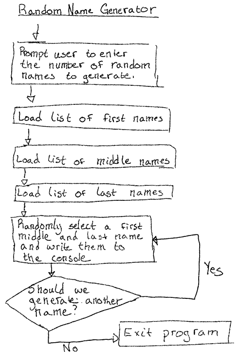
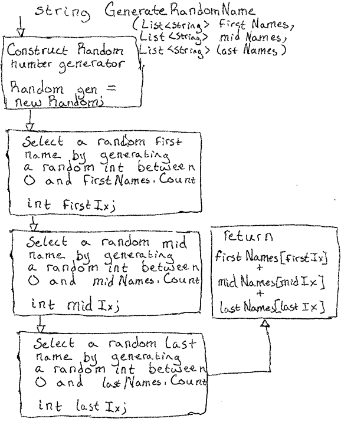

# Random Name Generator

## Description

The Random Name Generator is used to generate lists of funny names. It uses a
list of possible first, middle, and last names to generate an almost infinite
number of possible outcomes.

## Overview

The purpose of Random Name Generator is to provide entertainment to the user by
generating funny names. It accepts input from the user by letting them specify
the number of names they want to generate. After accepting the number of names
to generate, the program writes a list of random names to the console.

## High Level Design

At a high level, the Random Name Generator works in the following way:

1. Prompts the user to enter the number of random names to generate
2. Loads a list of possible first names
3. Loads a list of possible middle names
4. Loads a list of possible last names
5. Randomly selects a first, middle, and last name
6. Writes the randomly generated name to the console
7. If more names need to be generated, go to step 5
8. Otherwise, the program exits

### Flowchart

## Methods

To help manage the complexity of the program, I have chosen to write two helper
methods:

* `int GetPositiveInt(string prompt);`
* `string GenerateRandomName(List<string> firstNames, List<string> midNames,
  List<string> lastNames);`

### int GetPositiveInt(string prompt);

Given a prompt to show to the user, displays the prompt then reads input from
the keyboard until the user enters a positive number. If the user enters a
non-positive number, this method displays an error message and prompts the user again.

1. Validate the prompt is a string
2. Display the prompt
3. Read input from the user
4. If the user entered a non-positive number,
   * Display an error message
   * Go to step 2
5. Otherwise, return the users input 

### string GenerateRandomName(List<string> firstNames, List<string> midNames,
  List<string> lastNames);

Given a list of first, middle, and last names, generate a random name using one
entry from each list.

1. Create a random number generator
2. Generate a random number, firstIndex, between 0 and firstNames.Count
3. Generate a random number, midIndex, between 0 and midNames.Count
4. Generate a random number, lastIndex, between 0 and lastNames.Count
5. Combine the names together
   * `firstNames[firstIndex] + " " + midNames[midIndex] + " " + lastNames[lastIndex];`
6. Return the name