# Part 2.2: Write Method Tests

Now that you have an outline of your project and method stubs you can call, you
can begin creating tests for your methods. This is important as it will provide
you with confidence that each component of your project works independently.
Only when each component is working independently should you combine them
together.

- [Part 2.2: Write Method Tests](#part-22-write-method-tests)
  - [Before Starting](#before-starting)
  - [1. Create a Test Class for Each Method](#1-create-a-test-class-for-each-method)
  - [2. Add a Test Method to Each of your Classes](#2-add-a-test-method-to-each-of-your-classes)
  - [3. Write a TestAll Method in your Program.cs file](#3-write-a-testall-method-in-your-programcs-file)
  - [4. Run Your Tests](#4-run-your-tests)
  - [5. Add Tests](#5-add-tests)
  - [Commit, Tag, and Push your tests](#commit-tag-and-push-your-tests)
  - [6. Run Your Tests and Update your Code Until they pass](#6-run-your-tests-and-update-your-code-until-they-pass)
    - [Example Implementing LoadFile](#example-implementing-loadfile)

## Before Starting

Before starting this section, you should:

* Have a working draft of your proposal
* Create Method stubs for each method in your proposal

## 1. Create a Test Class for Each Method

Start by creating a new class file for each of your methods. For example, if you
had the following methods: 

* `public static List<string> LoadFile(string filename)`
* `public static int GetUserSelection(List<string> options)`

You would create two new files:

* TestLoadFile.cs
* TestGetUserSelection.cs

Within each file, you should add a class that matches the filename.

### TestLoadFile.cs <!-- omit in toc --> 

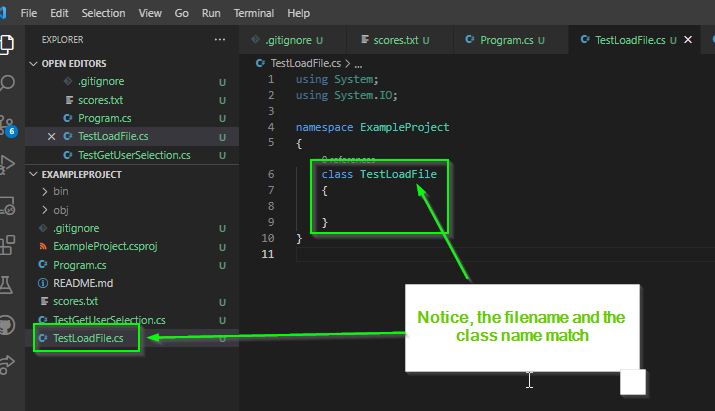

**Note**: Your namespace should match the namespace from your `Program.cs` file.

### TestGetUserSelection.cs <!-- omit in toc --> 

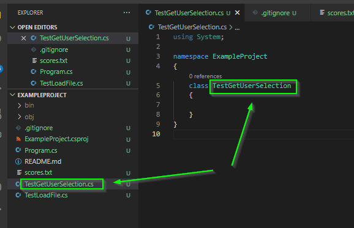

## 2. Add a Test Method to Each of your Classes

Next, within each of your test classes, add a test method with the following
signature:

```csharp
public static bool RunTest()
{
    return false;
}
```

The idea is that you will use this method to test your method. If all the tests
pass, you will return `true`. This indicates that your implementation of the
tested method likely works. Otherwise, you will return `false`. Because you
have not added any actual tests yet, we return `false` to indicate that this
method probably does not work as intended yet.

### TestLoadFile.cs <!-- omit in toc --> 

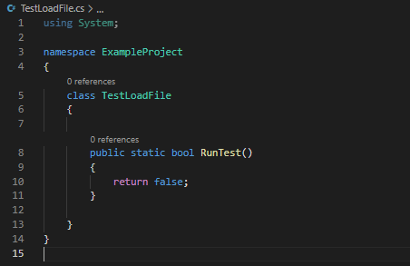

### TestGetUserSelection.cs <!-- omit in toc --> 

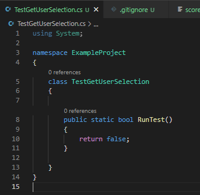

## 3. Write a TestAll Method in your Program.cs file

Next, we will add a `TestAll()` method to our `Program.cs` file which will
execute all of the method tests.

Within the `Program.cs` file add the following method stub:

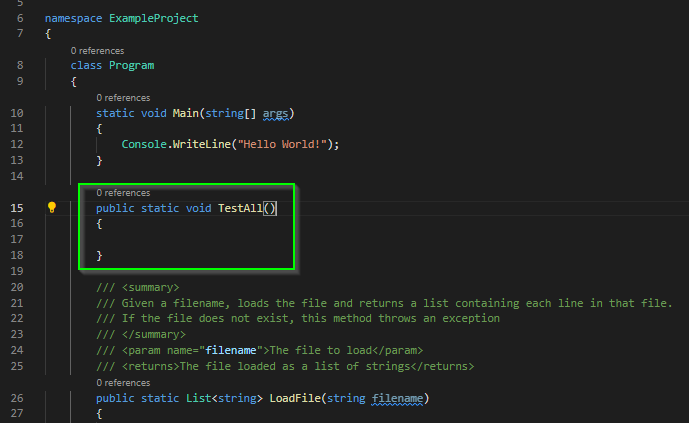

Inside of the `TestAll()` method, you should run each of the tests you wrote and
write the result to the console. For example, with the two methods in the
example project, you would write the following:

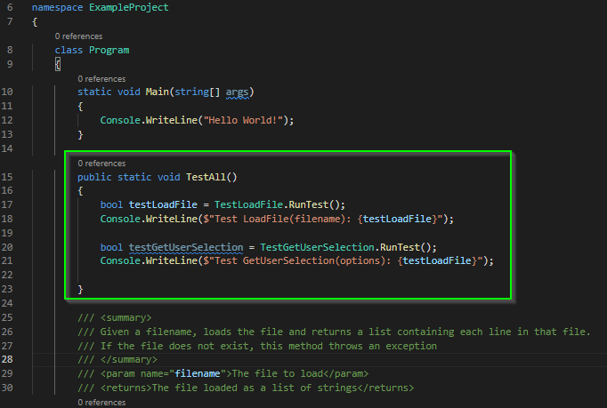

## 4. Run Your Tests

In your `Main` method, we will add in a simple if statement that checks to see
if the program should execute `TestAll()` or if it should start your program.

To do this: 

1. First check to see if the user specified a command line argument
2. If they did and the argument is "test"
   * Call `TestAll()` 
   * Then, return from the `Main` method to exit the program
3. Otherwise, the program executes as normal


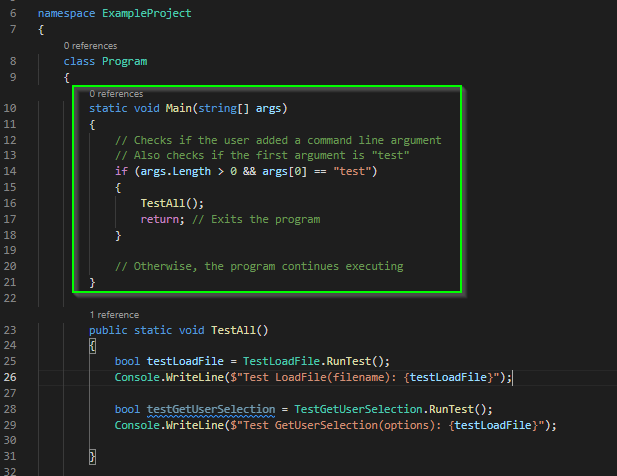

Finally, in the terminal you can now run `dotnet run test`. If you do, you
should see the output of all of your tests:

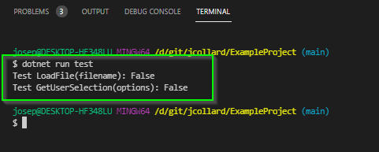

Initially, all of the tests should return `False`. This is because you have not
yet written a test.

## 5. Add Tests

Next, think about how each of your methods should work:

1. What inputs should your methods accept?
2. What inputs should your methods not accept?
3. What outputs should your methods produce?
4. What are weird inputs that are technically possible?

For each of your methods, update the `RunTest()` method to contain tests
demonstrating the input and outputs. The general flow of each test method should
follow:

1. Call the method with some values
2. Store the result in a variable
3. Use an if statement to check that the result is what you expected
4. If the result was unexpected, display an error message and return false
5. Otherwise, perform another check
6. When you've performed enough checks, return true

### TestLoadFile.cs <!-- omit in toc --> 

The `TestLoadFile.TestRun()` method accepts any string as input. If the string is
not a valid file, the method throws an exception. If the string is a valid file,
it should return a list of strings containing the files contents.

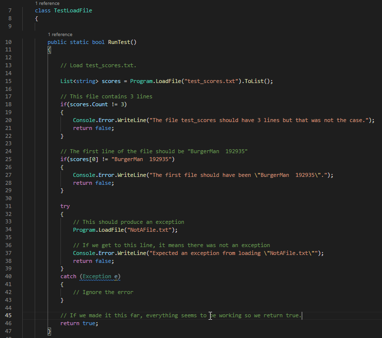

One thing to note here is the `try` and `catch` syntax which we have not covered
in class. All you need to know is that this code allows us to detect if an
exception occurred without crashing the program. We can use this to write tests.

### TestGetUserSelection.cs <!-- omit in toc --> 

The `TestGetUserSelection.TestRun()` method displays a list to the screen and
then asks the user to enter a number. Then, the number must be an index within
the list.

It is challenging to write a test method because the method outputs to the
terminal (rather than returning a value) and waits for user input (rather than
accepting parameters). Unfortunately, these methods are much harder to test.

To test them, you will display a message giving instructions for the user to
test the method. Finally, you should return False. This doesn't mean that the
test failed but that the test cannot be automatically checked.

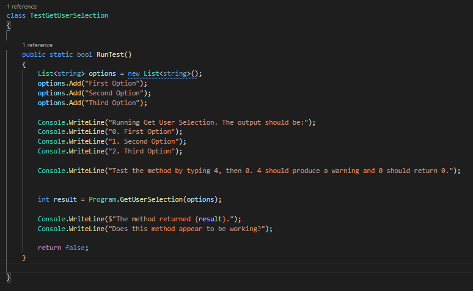

## Commit, Tag, and Push your tests

At this point, the first draft of your tests are complete. You should:

1. Commit your work (`feat: Add tests for methods`)
2. Tag your work (`method-tests-v1`)
3. Push your work for feedback

## 6. Run Your Tests and Update your Code Until they pass

The general work flow from here should be:

1. Run tests
2. If tests fail:
    * Try to fix the first failure
    * Rerun tests
3. If all tests pass, you're ready to connect the parts together!

### Example Implementing LoadFile

Now that you have some tests, you can actually run them with `dotnet run test`.

Here is the output from a failing version of the Example Proposal:

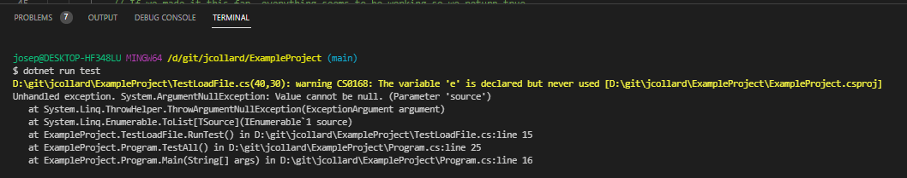

Bummer! My program crashed. It tells me that there is a `null` value that is
causing a problem. If I look closely at this error, it will show me which lines
of codes caused this error:

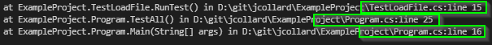

If I follow that error, I find that it is because my `LoadFile` method always
returns `null`.

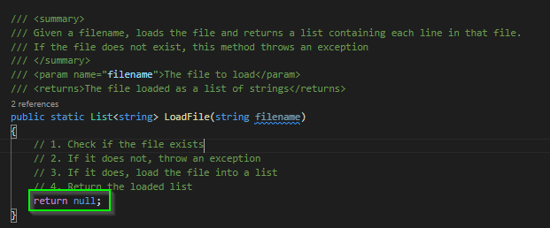

Okay, to fix this, I need to create a list to store my results and then return
it so that I'm not returning null. I update my code:

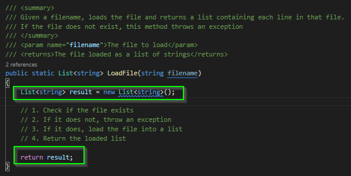

Then run my tests again:

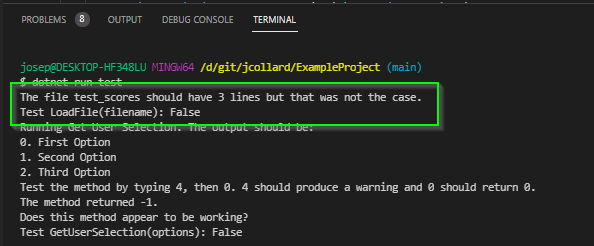

Progress! My program no longer crashes. Instead, I see output that tells me that
the list should have 3 elements in it. This is because I just returned an empty
list.

To fix this, I need to actually load the data from the file and store it in the
list before returning it. So, I update my code. While I'm at it, I go ahead and
implement the rest of the method:

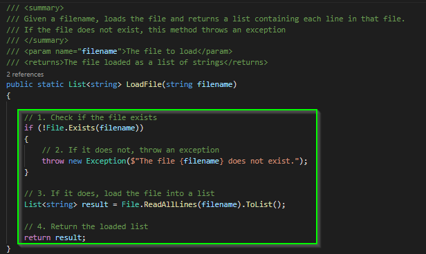

Then, I run my tests again:

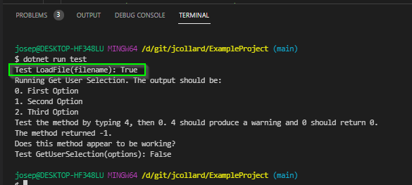

Alright, my test passes! Time for the next test.

I would continue this process until all of my tests pass.